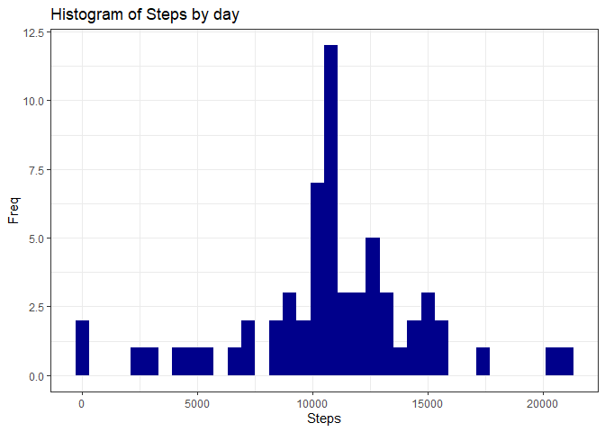
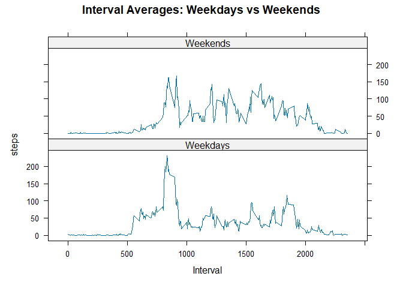

## Loading and preprocessing the data

1.  Load the data

``` r
linkURL <- "https://d396qusza40orc.cloudfront.net/repdata%2Fdata%2Factivity.zip"
download.file(linkURL, destfile = "activity.zip")
unzip(zipfile = "activity.zip")
activity <- read.csv("activity.csv", header = TRUE, sep = ",")
file.remove("activity.zip")
```

2.  Transform the data

``` r
activity$date <- as.Date(activity$date, "%Y-%m-%d")
```

3.  See the head of the data

``` r
head(activity)
```

```
##   steps       date interval
## 1    NA 2012-10-01        0
## 2    NA 2012-10-01        5
## 3    NA 2012-10-01       10
## 4    NA 2012-10-01       15
## 5    NA 2012-10-01       20
## 6    NA 2012-10-01       25
```

``` r
str(activity)
```

```
## 'data.frame':	17568 obs. of  3 variables:
##  $ steps   : int  NA NA NA NA NA NA NA NA NA NA ...
##  $ date    : Date, format: "2012-10-01" "2012-10-01" ...
##  $ interval: int  0 5 10 15 20 25 30 35 40 45 ...
```

## What is mean total number of steps taken per day?

1.  Calculating the steps by day

``` r
day_steps <- aggregate(steps ~ date, activity, FUN = sum)
```

2.  Histogram of number of steps

``` r
g <- ggplot(day_steps, aes(x=steps))
g + 
        geom_histogram(fill = "darkblue", binwidth = 600) +
        labs(title = "Histogram of Steps by day", x = "Steps", y = "Freq") +
        theme_bw()
```

<!-- -->

3.  Calculate the mean and median of total steps per day

``` r
step_mean <- mean(day_steps$steps, na.rm = TRUE)
step_median <- median(day_steps$steps, na.rm = TRUE)
```

The mean is 1.0766189\times 10^{4} and the median is 10765.

## What is the average daily activity pattern?

1.  Calculating interval

``` r
intervaldb <- group_by(activity, interval) %>% 
                summarise(steps=mean(steps, na.rm = TRUE)) %>%
                unique()
```

2.  Plotting the interval

``` r
g <- ggplot(intervaldb, aes(x=interval, y=steps))
g + 
        geom_line(color = "darkblue", linewidth = 0.5) +
        labs(title = "Average of daily steps", x = "Interval", y = "Average steps/day") +
        theme_bw()
```

<!-- -->

3.  5-minute interval with the maxium number of steps

``` r
max_interval <- intervaldb[which.max(intervaldb$steps),1]
```
The maximum interval is 835.

## Imputing missing values

1.  Calculating total missing values in the dataset

``` r
nas <- sum(is.na(activity$steps))
```

Total number of missing values: 2304.

2.  Imputing data on missing values. I used mean values of steps for filling the missing values. Firstly matched by interval across dates.

``` r
impute_activity <- activity %>%
        mutate(
                steps = case_when(
                        is.na(steps) ~ intervaldb$steps[match(activity$interval, intervaldb$interval)],
                        TRUE ~ as.numeric(steps)
                )
        )
```

3.  Re-creating the histogram

``` r
impute_day_steps <- aggregate(steps ~ date, impute_activity, FUN = sum)
g <- ggplot(impute_day_steps, aes(x=steps))
g + 
        geom_histogram(fill = "darkblue", binwidth = 600) +
        labs(title = "Histogram of Steps by day", x = "Steps", y = "Freq") +
        theme_bw()
```

<!-- -->

4.  Comparing impute vs. original

``` r
imp_step_mean <- mean(impute_day_steps$steps, na.rm = TRUE)
imp_step_median <- median(impute_day_steps$steps, na.rm = TRUE)
mean_dif <- imp_step_mean - step_mean
median_dif <- imp_step_median - step_median
```
|          |        Mean     | Median            | Diff            |
|----------|-----------------|-------------------|-----------------|
| Original |1.0766189\times 10^{4}    |10765    |0     |
| Impute   |1.0766189\times 10^{4}|1.0766189\times 10^{4}|1.1886792   |

## Are there differences in activity patterns between weekdays and weekends?

``` r
impute_activity$weekF <- as.factor(ifelse(weekdays(as.Date(impute_activity$date))=="sábado"| weekdays(as.Date(impute_activity$date))=="domingo", "Weekends", "Weekdays"))
aggregate_impute_activity <- aggregate(steps~interval + weekF, impute_activity, mean)
xyplot(steps~interval|weekF,
       data=aggregate_impute_activity,
       main="Interval Averages: Weekdays vs Weekends",
       xlab="Interval",
       layout=c(1,2),
       type="l",
       color = "darkblue")
```

<!-- -->


